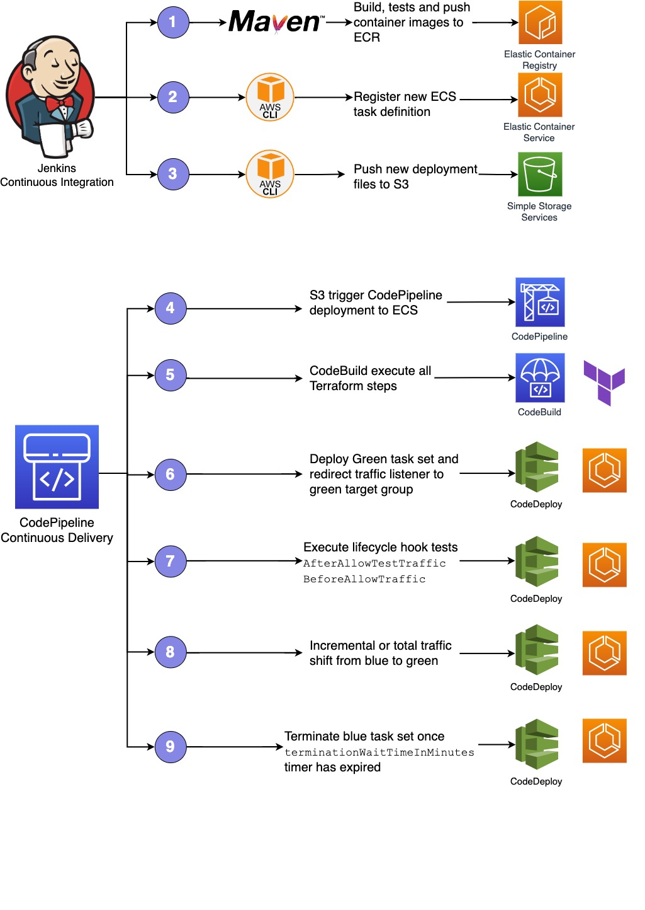

# Fargate with Blue Green Deployment using Jenkins, AWS CodePipeline, AWS CodeBuid and AWS CodeDeploy

This example deploys a fully ECS Cluster with FARGATE mode. It creates all the necessary infrastructure, such as the VPC, Application Load Balancer and the necessary Roles in 3 availability zones.

It also creates all ECS setup, like cluster, service, tasks, auto scaling and the deploy mode (blue green).

### Jenkins

This example creates a Jenkins server on EC2. You should connect to http://<PUBLIC_IP_JENKINS>:8080 and follow the instructions. To get the admin password, you can connect on EC2 via SSM Sessions Manager.

* Create a Pipeline to get configuration via SCM (git). You can use Jenskinsfile on main branch from this [Sample Repository](https://github.com/fsavoia/amazon-ecs-demo-with-node-express)
* Replace your values on Jenkinsfile after deployment below.

### CI/CD

All deployment steps is done through a Pipeline using Jenkins for CI, CodePipeline, CodeBuild and CodeDeploy. In this example, the Terraform flow it's executed via AWS Codebuild before application deployment.



### tfsec

During the pipeline execution, we can check the security checks pased to our tfsec configuration 


This configuration is running inside of an AWS Codebuild Container ith the configuration stated at [buildspec_tfsec](https://github.com/fsavoia/amazon-ecs-demo-with-node-express/blob/main/terraform/buildspec_tfsec.yaml). We highly recommend you to check the [tfsec documentation](https://tfsec.dev/docs/aws/home/) to review the configuration and modify as you need.

Besides this output, AWS Codebuild also exports the result of tfsec report on the Codebuild reports section


Our pipeline have several manual process:
- Manual process to review the security checks passed via tfsec.
- Manual process to review the Terraform plan output.


## to-do
* Terraform: IAM policies more restrictive

## How to Deploy

### Prerequisites:

If you will use remote backend (recommended), please, you have to configure the file below (you have to create the resources before), otherwise, just simple remove this file for local backend

```shell script
backend.tf
```

If you want an example about how to create your remote backend infrastructure, go to [infra_backend](infra_backend) directory and replace [variables.tf](infra_backend/variables.tf) file with your data and follow the steps below

```shell script
export AWS_REGION=<ENTER YOUR REGION>   # Select your own region
terraform init
terraform plan
terraform apply
```


Ensure that you have installed the following tools in your Mac or Windows Laptop before start working with this module and run Terraform Plan and Apply

1. [AWS CLI](https://docs.aws.amazon.com/cli/latest/userguide/install-cliv2.html)
2. [Terraform](https://learn.hashicorp.com/tutorials/terraform/install-cli)

### Deployment Steps

#### Step 1: Clone the repo using the command below

```shell script
git clone '<this repository>'
```

#### Step 2: Run Terraform INIT

Initialize a working directory with configuration files

```shell script
cd '<this repository directory>'
terraform init
```

#### Step 3: Run Terraform PLAN

Verify the resources created by this execution

```shell script
export AWS_REGION=<ENTER YOUR REGION>   # Select your own region
terraform plan
```

#### Step 4: Terraform APPLY

to create resources

```shell script
terraform apply
```

Enter `yes` to apply

## How to Destroy

The following command destroys the resources created by `terraform apply`

```shell script
cd '<this repository directory>'
terraform destroy --auto-approve
```

<!-- BEGINNING OF PRE-COMMIT-TERRAFORM DOCS HOOK -->
## Requirements

| Name | Version |
|------|---------|
| <a name="requirement_terraform"></a> [terraform](#requirement\_terraform) | >= 1.0.0 |
| <a name="requirement_aws"></a> [aws](#requirement\_aws) | >= 3.72 |

## Providers

| Name | Version |
|------|---------|
| <a name="provider_aws"></a> [aws](#provider\_aws) | >= 3.72 |

## Modules

| Name | Source | Version |
|------|--------|---------|
| <a name="module_aws_vpc"></a> [aws\_vpc](#module\_aws\_vpc) | terraform-aws-modules/vpc/aws | ~> 3.0 |
| <a name="module_eks_blueprints"></a> [eks\_blueprints](#module\_eks\_blueprints) | ../.. | n/a |
| <a name="module_eks_blueprints_kubernetes_addons"></a> [eks\_blueprints_kubernetes_addons](#module\_eks\_blueprints_kubernetes_addons) | ../.. | n/a |


## Inputs

| Name | Description | Type | Default | Required |
|------|-------------|------|---------|:--------:|
| <a name="input_environment"></a> [environment](#input\_environment) | Environment area, e.g. prod or preprod | `string` | `"preprod"` | no |
| <a name="input_tenant"></a> [tenant](#input\_tenant) | Account Name or unique account unique id e.g., apps or management or aws007 | `string` | `"aws001"` | no |
| <a name="input_zone"></a> [zone](#input\_zone) | zone, e.g. dev or qa or load or ops etc... | `string` | `"dev"` | no |

## Outputs

| Name | Description |
|------|-------------|
| <a name="output_configure_kubectl"></a> [configure\_kubectl](#output\_configure\_kubectl) | Configure kubectl: make sure you're logged in with the correct AWS profile and run the following command to update your kubeconfig |
<!-- END OF PRE-COMMIT-TERRAFORM DOCS HOOK -->